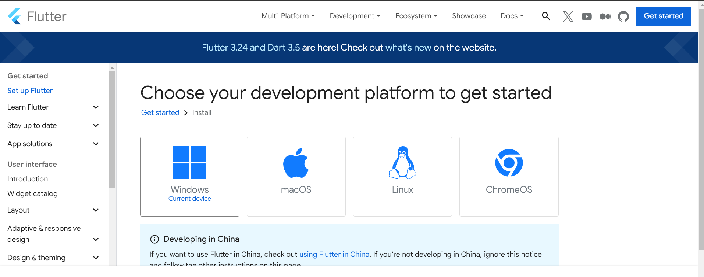
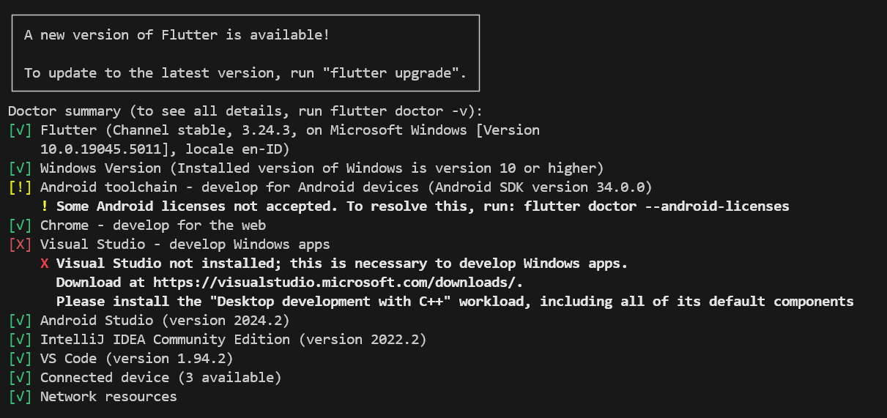
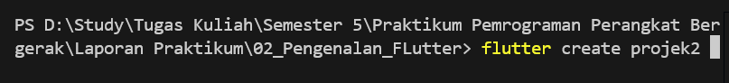
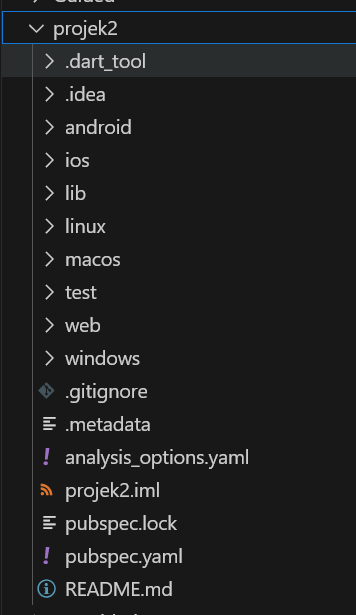

Nama Praktikan  : Rafli Dhafin Kamil
NIM             : 2211104018
Kelas           : S1SE0601
Laporan         : Modul1_Running_Modul             

Hasil Praktikum 

1. Tugas Praktikum Pertemuan Pertama Adalah Melakukan Instalasi SDK Untuk Flutter 

- Pergi Ke Halaman Web https://flutter.dev/

- Pergi Ke Laman Docs Untuk Melakukan Instalasi 

2. Saya Akan Mempercepat Step Instalasi Selesai, Untuk melihat Instalasi berhasil, Cukup Ketik Perintah Pada Terminal "flutter doctor" dan akan muncul tampilan berikut

3. Untuk Membuat Projek Anda Dapat Melakukan Ketik Perintah "flutter create nama_project" pada direktori kerja 

Maka Project Flutter Alan Berhasil Dibuat dan Anda Sudah Dapat Melakukan Pengembangan Flutter

