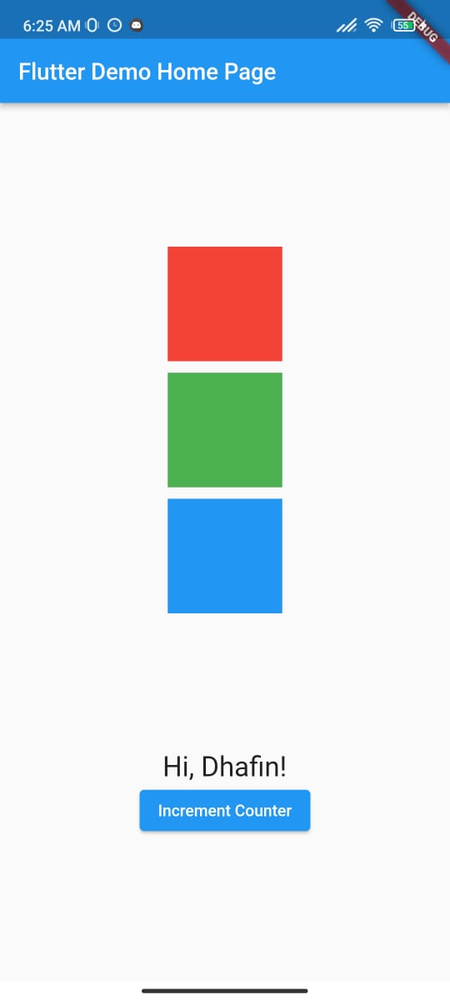

laporan.md
Flutter sederhananya merupakan framework untuk merancang aplikasi berbasis bahasa pemrograman Dart
Dart sendiri adalah bahasa pemrograman yang dikembangkan dan didukung oleh Google Sebagai Bahasa Pengembangan Untuk Android

Flutter Dikenal dengan bahasa pemrograman yang friendly dan open source,selain itu banyak package yang didukung oleh komunitas

<!-- Contoh Eksekusi Model real Pada Projek FLutter Saya -->

dan saya juga sudah menjalankan tugas untuk membuat widget

