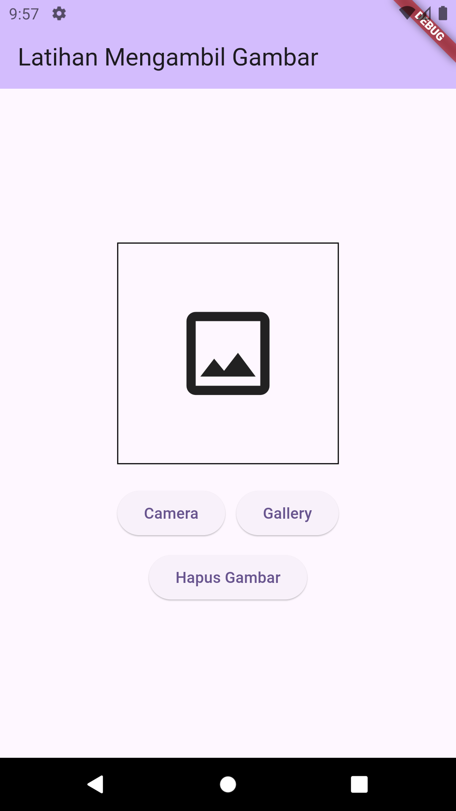

TUGAS PENDAHULUAN
PEMROGRAMAN PERANGKAT BERGERAK

MODUL IX
API PERANGKAT KERAS

Disusun Oleh :
 Rafli Dhafin Kamil / 2211104018
 S1SE0601

Asisten Praktikum : Muhammad Faza Zulian Gesit Al Barru
Aisyah Hasna Aulia

Dosen Pengampu :
Yudha Islami Sulistya, S.Kom., M.Cs.

PROGRAM STUDI S1 SOFTWARE ENGINEERING FAKULTAS INFORMATIKA
TELKOM UNIVERSITY PURWOKERTO 2024
 

TUGAS PENDAHULUAN

A. SOAL NOMOR 1
a) Buatlah satu project baru, yang mana di dalamnya memuat container berisi Icons.image_outlined, button camera, button gallery dan button hapus gambar. Button tidak harus berfungsi.

Contoh tampilan
 

Source code

	
import 'package:flutter/material.dart';

void main() {
  runApp(const MyApp());
}

class MyApp extends StatelessWidget {
  const MyApp({super.key});

  @override
  Widget build(BuildContext context) {
    return MaterialApp(
      title: 'Flutter Demo',
      theme: ThemeData(
        colorScheme: ColorScheme.fromSeed(seedColor: Colors.deepPurple),
        useMaterial3: true,
      ),
      home: const MyHomePage(title: 'Latihan Mengambil Gambar'),
    );
  }
}

class MyHomePage extends StatefulWidget {
  const MyHomePage({super.key, required this.title});

  final String title;

  @override
  State<MyHomePage> createState() => _MyHomePageState();
}

class _MyHomePageState extends State<MyHomePage> {
  @override
  Widget build(BuildContext context) {
    return Scaffold(
      appBar: AppBar(
        backgroundColor: Theme.of(context).colorScheme.inversePrimary,
        title: Text(widget.title),
      ),
      body: Center(
        child: Column(
          mainAxisAlignment: MainAxisAlignment.center,
          children: <Widget>[
            Container(
              width: 200,
              height: 200,
              decoration: BoxDecoration(
                border: Border.all(color: Colors.black),
              ),
              child: const Icon(
                Icons.image_outlined,
                size: 100,
              ),
            ),
            const SizedBox(height: 20),
            Row(
              mainAxisAlignment: MainAxisAlignment.center,
              children: [
                ElevatedButton(
                  onPressed: () {},
                  child: const Text('Camera'),
                ),
                const SizedBox(width: 10),
                ElevatedButton(
                  onPressed: () {},
                  child: const Text('Gallery'),
                ),
              ],
            ),
            const SizedBox(height: 10),
            ElevatedButton(
              onPressed: () {},
              child: const Text('Hapus Gambar'),
            ),
          ],
        ),
      ),
    );
  }
}

Screenshoot Output
 

Deskripsi Program
Program ini bertujuan untuk melakukan input upload gambar dari storage dan akan disimpan kedalam aplikasi, namun saat ini hanya berupa tampilan saja karena kedepannya akan dilakukan implementasi fungsi tersebut.
